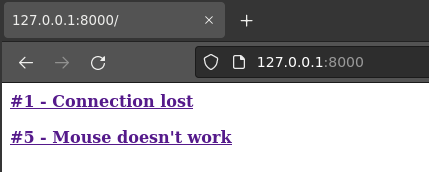
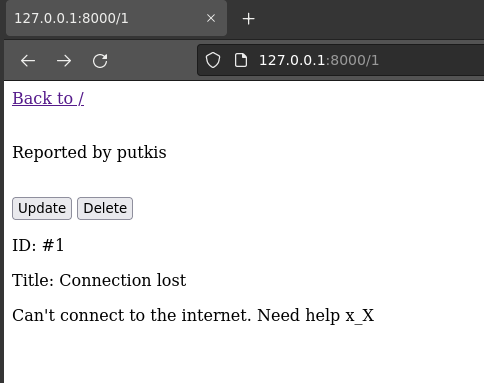
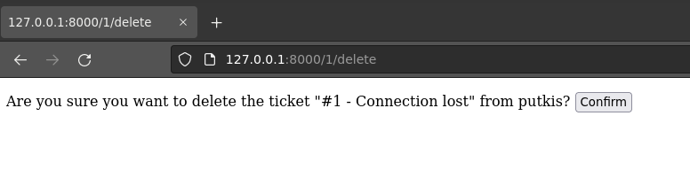

# simple-django
Simple Ticket System - Course Practice (repository will be hidden after course)

## Features
CRUD
- C: Create Ticket
- R: Read Tickets
- U: Update Tickets
- D: Delete Tickets

## Requirements
    django==3.2

## Installation

I Don't recommend install this unless you are teacher or student in the course. 

1. Install virtualenv (sudo apt-get install virtualenv) and git (sudo apt-get install git)
2. Make a new directory
    - mkdir django
    - cd django
3. Create and activate a virtual environment
    - virtualenv env/ -p python3 --system-site-packages
    - source env/bin/activate
4. Install Django
    - which pip # make you sure you are in virtualenv
    - echo "django==3.2" > requirements.txt
    - pip install -r requirements.txt
5. Clone this repository and change a directory
    - git clone https://github.com/PutkisDude/simple-django.git
    - cd simple-django/
6. Not needed for local testing - Change SECRET_KEY (./ticketsystem/settings.py line 23) 
7. Makemigrations and migrate
    - ./manage.py makemigrations
    - ./manage.py migrate
8. Create a superuser
    - ./manage.py createsuperuser
9. Run server
    - ./manage.py runserver
10. Login via admin panel http://127.0.0.1:8000/admin // login page under development
11. Open ListView:  http://127.0.0.1:8000

# Pics
### ListView

### DetailView

### DeleteConfirm
